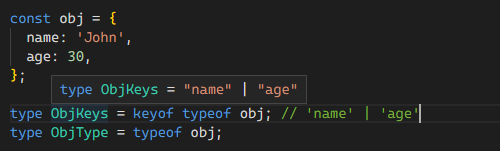

# 作业目标

实现一个类型过滤器类型 Filter<T, U>，用于过滤类型 T 中所有与类型 U 匹配的元素，并将这些元素组合成一个新的元素数组类型。

```ts
type Fruit = 'apple' | 'banana' | 'orange';
type Fruits = ['apple', 'banana', 'orange', 'cherry'];
type OnlyFruits = Filter<Fruits, Fruit>; // ['apple', 'banana', 'orange']
```

遍历 Object 和 递归方式两种

# 解题思路

这里需要了解 `keyof` 的使用

1. 条件类型中的 `keyof`: 在条件类型中，我们可以使用 `keyof` 来获取一个类型的所有属性名。例如，我们可以使用 `keyof T` 来获取类型 T 的属性名联合类型，然后根据这个属性名联合类型进行条件判断

2. 访问对象属性：我们可以使用 `keyof` 来访问一个对象的属性。例如，`keyof T` 将返回一个包含对象 `obj` 的所有属性名的联合类型

3. 类型推断：在一些情况下，TypeScript 可以根据上下文自动推断出 `keyof` 表达式的结果类型。这可以在某些类型安全的操作中发挥作用

4. 字符串索引签名：当定义一个包含字符串索引签名的类型时，我们可以使用 `keyof` 来获取该类型中的所有属性名联合类型。这对于进行类型检查和操作非常有用



所以说通过 `keyof` 可以得到变量所有类型的集合

然后通过 `in` 来访问集合，通过 `extends` 判断关系

使用 `extends` 的作用是限制了 T 的类型范围，确保传入的参数类型必须是只读数组类型。这样在类型检查时，只有满足这个条件的参数才能被使用

`instanceof` 运算符通常用于判断对象是否是某个类的实例。它是基于类的继承关系进行判断的，而不是用于判断类型是否属于一个联合类型或元组类型

# 代码

```ts
namespace Filter {
    type Fruit = 'apple' | 'banana' | 'orange';
    type Fruits = ['apple', 'banana', 'orange', 'cherry'];

    type Filter<T extends readonly any[], U> = {
        [K in keyof T]: T[K] extends U ? T[K] : never;
    }[number][];

    type OnlyFruits = Filter<Fruits, Fruit>; // ['apple', 'banana', 'orange']
}
```